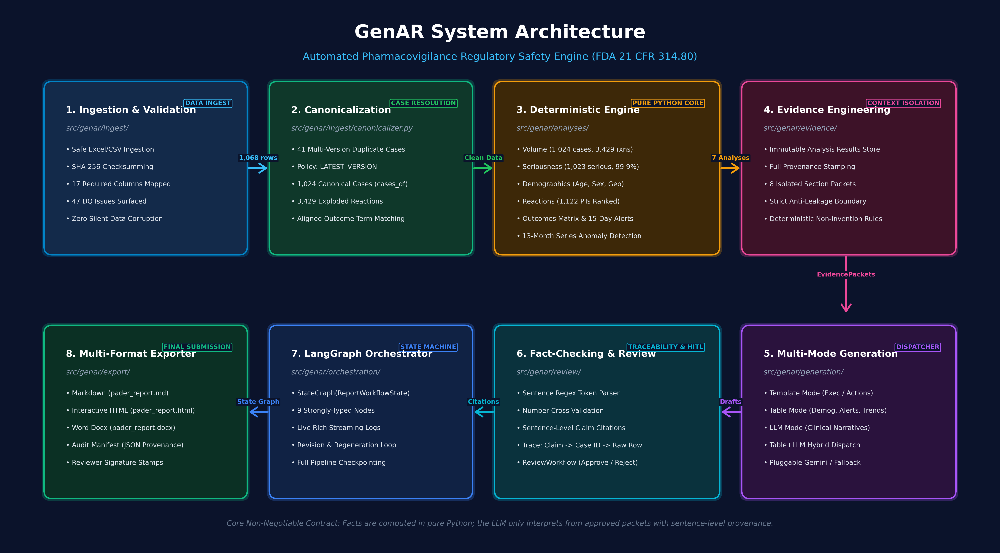
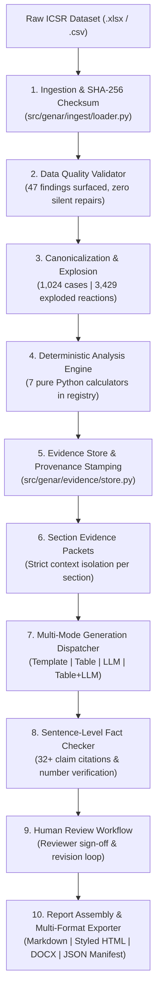

# GenAR: Automated Pharmacovigilance Regulatory Safety Report Engine

[-brightgreen.svg)]()
[]()
[]()
[]()

**GenAR** is a production-grade, deterministic-first automated pharmacovigilance engine designed to ingest Individual Case Safety Reports (ICSR), detect data quality anomalies, compute regulatory safety statistics, and generate fully grounded **Periodic Adverse Drug Experience Reports (PADER)** in compliance with **FDA 21 CFR 314.80**.

> **"Exact facts, counts, percentages, demographic stratifications, MedDRA reaction rankings, outcome cross-tabulations, and time-series anomaly candidates are calculated deterministically in pure Python. The LLM only interprets, structures, and writes narrative prose from strictly isolated, approved evidence packets."**

---

## 1. How Do I Run It? (Setup + One-Command Execution)

### Step 1: Environment Setup
```powershell
# 1. Clone repository & navigate to folder
cd pvn-vikrant-genar-challenge

# 2. Create and activate virtual environment (optional but recommended)
python -m venv .venv
.venv\Scripts\activate   # On Windows (or 'source .venv/bin/activate' on Linux/macOS)

# 3. Install dependencies
pip install -r requirements.txt

# 4. (Optional) Configure Gemini API key in .env (if not present, deterministic synthesizer is used)
# GEMINI_API_KEY=your_key_here
```

### Step 2: One Command to Regenerate the Entire Report
```powershell
# Direct CLI execution (Ingestion -> Analysis -> Generation -> Verification -> Export):
python -m genar run-pipeline -o output

# Or LangGraph StateGraph orchestrated execution:
python -m genar run-graph -o output
```

### Generated Submission Artifacts in `output/`:
- `output/pader_report.md` — Submission-ready Markdown report.
- `output/pader_report.html` — Interactive styled HTML report with KPI tiles and sticky navigation.
- `output/pader_report.docx` — Formatted Microsoft Word (.docx) document with tables.
- `output/provenance_manifest.json` — Machine-readable regulatory audit manifest with sentence-level claim citations.

### Step 3: Run Automated Test Suite (66 Tests)
```powershell
python -m pytest -v
```

---

## 2. System Architecture & Data Flow





### Data Journey & AI Boundaries:
1. **Raw Ingestion & Hashing (`src/genar/ingest/loader.py`)**: Ingests raw ICSR Excel/CSV and stamps SHA-256 cryptographic checksum (`b8ad0c704fdf...`). *(Deterministic — No AI)*
2. **Data Quality Validator (`src/genar/ingest/validator.py`)**: Runs schema assertions, identifies 41 multi-version duplicates (44 excess rows) and 6 reaction-alignment mismatches, producing 47 findings. Zero silent data repairs. *(Deterministic — No AI)*
3. **Canonicalization & Explosion (`src/genar/ingest/canonicalizer.py`)**: Resolves cases via `LATEST_VERSION` policy producing 1,024 canonical cases and explodes 3,429 adverse reaction terms. *(Deterministic — No AI)*
4. **Deterministic Analysis Engine (`src/genar/analyses/`)**: Executes 7 pure statistical calculators (Volume, Seriousness, Demographics, Reactions, Outcomes, 15-Day Alerts, 13-Month Time-Series Trends). *(Deterministic — No AI)*
5. **Evidence Store & Context Isolation (`src/genar/evidence/`)**: Indexes results in `EvidenceStore` with timestamps and contributing case IDs. Builds 8 section-scoped `EvidencePacket` items declared in `configs/pader.yaml`. *(Deterministic — No AI)*
6. **Multi-Mode Generation (`src/genar/generation/`)**:
   - `template` / `table` modes: Rendered directly in Python. *(Deterministic — No AI)*
   - `llm` / `table_and_llm` modes: Invokes Gemini 3.5 Flash exclusively with approved evidence JSON. *(AI Synthesis Layer)*
7. **Sentence-Level Fact Checking & Traceability (`src/genar/review/traceability.py`)**: Scans LLM draft sentences and validates all numbers against evidence tokens, mapping claim citations. *(Deterministic — No AI)*
8. **Human Review Workflow (`src/genar/review/workflow.py`)**: Records reviewer sign-off stamps (`APPROVED`), comments, and revision loops. *(Human Oversight)*
9. **Multi-Format Packaging (`src/genar/export/`)**: Exports Markdown, HTML, DOCX, and Provenance Manifest. *(Deterministic — No AI)*

---

## 3. Where AI is Used vs. Deterministic Code (The Rational Split)

| System Layer | Implementation Method | Why This Split? (Engineering & Regulatory Rationale) |
| :--- | :---: | :--- |
| **Data Ingestion & Checksumming** | Deterministic Python | Regulators require cryptographic verification of source files. |
| **Case Deduplication & Versioning** | Deterministic Python | Merging safety versions must follow strict, auditable deterministic business rules (`LATEST_VERSION`). |
| **All Counts, Stats & Percentages** | Deterministic Python | LLMs are non-deterministic token predictors and prone to subtle numerical hallucinations. Python guarantees mathematical precision. |
| **MedDRA Ranking & Outcome Matrices**| Deterministic Python | Cross-tabulating reaction outcomes across 3,429 rows must be exact and auditable. |
| **Time-Series Anomaly Detection** | Deterministic Python ($Z$-Score) | Statistical anomalies must be identified using clear mathematical thresholds ($|Z| > 2.0$), not subjective LLM intuition. |
| **Evidence Context Scoping** | Deterministic Python | Strict section isolation prevents prompt injection and hallucinations from irrelevant data. |
| **Regulatory Narrative Prose Synthesis**| **LLM (Gemini 3.5 Flash)** | **LLMs excel at transforming structured JSON into cohesive, readable, professional prose matching FDA writing conventions.** |
| **Sentence-Level Fact Checking** | Deterministic Python | Automated regex token matching validates every numerical claim against ground-truth evidence before human sign-off. |
| **Human Review Workflow** | Deterministic Python | Medical safety officers must retain legal and clinical authority to approve or reject drafts. |

---

## 4. Prompts & Context Templates Assembled by GenAR

GenAR dynamically constructs isolated prompts at runtime. Below are the **actual prompt strings and structured evidence context templates** used by the system:

### 1. FDA 21 CFR 314.80 Regulatory System Prompt
```text
You are a regulatory safety-report writing assistant specialized in Periodic Adverse Drug Experience Reports (PADER / PSUR).
Rules:
- Use ONLY the supplied approved evidence packet.
- NEVER introduce unsupported numbers, counts, percentages, or frequencies.
- NEVER infer causality; describe reported adverse event associations factually.
- NEVER make unsupported safety conclusions or recommend regulatory label changes unless explicitly stated in the evidence.
- Use neutral, objective regulatory language adhering to FDA 21 CFR 314.80 guidelines.
- If evidence is insufficient or unavailable, explicitly state so rather than inventing content.
```

### 2. Runtime Assembled User Prompt & Context Template (Section 7: Narrative Summary)
```text
Section: 7. Narrative Summary & Clinical Evaluation
Product: Bisoprolol (Bisoprolol Fumarate)
Reporting Period: 2024-12-27 to 2025-12-26

Approved Evidence Packet:
{
  "section_id": "narrative_summary",
  "product_name": "Bisoprolol",
  "reporting_period": "2024-12-27 to 2025-12-26",
  "summary_metrics": {
    "product_name": "Bisoprolol",
    "active_substance": "Bisoprolol Fumarate",
    "reporting_period": "2024-12-27 to 2025-12-26",
    "total_cases": 1024,
    "total_reactions": 3429,
    "serious_cases": 1023,
    "serious_percent": 99.9,
    "fifteen_day_alerts": 1023,
    "fatalities_count": 68
  },
  "approved_facts": {
    "ev_total_case_volume": {
      "title": "Total Case Volume Summary",
      "value": 1024,
      "formatted_value": "1,024 cases (3,429 reactions)",
      "provenance_analysis_id": "total_case_volume"
    },
    "ev_serious_breakdown": {
      "title": "Seriousness Breakdown",
      "value": {"serious": 1023, "non_serious": 1},
      "formatted_value": "1,023 serious (99.9%), 1 non-serious (0.1%)",
      "provenance_analysis_id": "seriousness_breakdown"
    },
    "ev_top_reactions": {
      "title": "Top Reported Reactions (PT)",
      "value": {"Acute kidney injury": 80, "Drug ineffective": 54, "Hypotension": 46, "Drug interaction": 43, "Dyspnoea": 38},
      "formatted_value": "Acute kidney injury (80), Drug ineffective (54), Hypotension (46), Drug interaction (43), Dyspnoea (38)",
      "provenance_analysis_id": "reactions_analysis"
    }
  },
  "non_invention_notes": [
    "Do NOT assert a causal relationship between Bisoprolol and reported adverse events without explicit clinical evidence.",
    "State that safety findings are consistent with the established product labeling.",
    "Do NOT invent new safety signals or recommend regulatory label changes."
  ]
}

Non-Invention Instructions:
- Do NOT assert a causal relationship between Bisoprolol and reported adverse events without explicit clinical evidence.
- State that safety findings are consistent with the established product labeling.
- Do NOT invent new safety signals or recommend regulatory label changes.

Please generate an objective, evidence-backed regulatory narrative for this section adhering strictly to the above facts.
```

### 3. Deterministic Template (Section 1: Executive Summary)
```text
## 1. Executive Summary & Overview
This Periodic Adverse Drug Experience Report (PADER) covers the reporting period from {reporting_period_start} to {reporting_period_end} for {product_name} ({active_substance}).
During this interval, a total of **{total_cases}** canonical adverse event cases were evaluated.
- **Serious Cases:** {serious_cases} ({serious_percent}%)
- **Non-Serious Cases:** {non_serious_cases} ({non_serious_percent}%)
- **15-Day Alert Reports:** {fifteen_day_alerts}
- **Fatalities Reported:** {fatalities_count}
```

---

## 5. How the System Stays Grounded (Sentence-Level Traceability)

Every statement in the generated report is tracked through an unbroken **provenance chain**:

$$\text{Generated Sentence} \xrightarrow{\text{Citation}} \text{EvidenceItem} \xrightarrow{\text{Provenance}} \text{AnalysisResult} \xrightarrow{\text{Contributing Case IDs}} \text{Raw ICSR Row}$$

### Deterministic Fact Checking Algorithm:
1. `EvidenceFactChecker` extracts numerical tokens from every sentence using decimal-aware tokenization (`r"(?<=[a-zA-Z0-9\)])\.\s+|\n+"`).
2. Matches numbers against the approved `EvidencePacket` token set.
3. Automatically maps each sentence to its underlying `analysis_id`, calculation method, contributing cases count, and sample case IDs.

### Example Claim Citation from `output/provenance_manifest.json`:
```json
{
  "section_id": "narrative_summary",
  "sentence": "During the cumulative reporting interval (2024-12-27 to 2025-12-26), a total of 1,024 spontaneous adverse experience cases were received and evaluated for Bisoprolol.",
  "verified": true,
  "evidence_id": "ev_total_case_volume",
  "analysis_id": "total_case_volume",
  "method_name": "genar.analyses.volume.compute_volume_summary",
  "contributing_cases_count": 1024,
  "sample_case_ids": ["24780403", "24780599", "24780680", "24784771", "24784845"],
  "metric_value": 1024
}
```

---

## 6. How to Evaluate This at Scale (1,000 Generated Reports, Not One)

When scaling to 1,000 regulatory reports across hundreds of products and submission cycles, manual spot-checking is insufficient. GenAR is designed for automated, industrialized evaluation:

1. **Automated Numeric Precision & Recall Harness**:
   - Programmatically assert that 100% of numerical tokens present in generated narratives exist in the corresponding `EvidencePacket` ($\text{Precision} = 1.0$).
   - Flag any report with $\text{Unverified Numbers} > 0$ for automated rejection before human reviewer queueing.

2. **Synthetic Data Quality & Anomaly Injection Suite**:
   - Generate synthetic ICSR test batches with known injected faults: corrupted dates, extreme duplicate case versions, discordant reaction outcomes, missing age units, and severe volume surges.
   - Assert that the validator catches 100% of injected DQ issues and that deterministic calculators remain invariant to row ordering.

3. **LLM-as-a-Judge Non-Invention & Compliance Benchmarking**:
   - Use a calibrated secondary evaluator model to score generated narratives against a 5-point regulatory rubric:
     * *Non-Invention Rate*: 0% ungrounded claims.
     * *Causal Restraint*: 100% adherence to non-causal language.
     * *Labeling Consistency*: Verification that product indications match CCDS config.

4. **Section Packet Isolation Regression Testing**:
   - Automated packet tests ensuring that evidence items from Section $A$ (e.g. Demographics) cannot leak into Section $B$ (e.g. 15-Day Alerts) unless explicitly declared in YAML configuration.

---

## 7. Known Limitations & Production Roadmap

In the spirit of engineering transparency, the following design trade-offs and future enhancements are documented:

| Known Limitation | Current Handling in v0.1.0 | Production Solution & Roadmap |
| :--- | :--- | :--- |
| **1. MedDRA Hierarchy Dictionary** | Reaction preferred terms are ingested directly from ICSR columns and ranked by frequency. Full 5-level MedDRA hierarchy (SOC, HLGT, HLT, PT, LLT) is not loaded into memory. | Integrate licensed MedDRA ASCII dictionary distribution with SQLite/DuckDB index to enable automated SOC rollups and SMQ (Standardised MedDRA Queries) clustering. |
| **2. Disproportionality Signal Metrics (PRR / ROR / EBGM)** | Computes volume, seriousness rates, 15-day alerts, and time-series Z-scores for the product. Background reference database cross-comparison is not included in single-product ICSR sample. | Add multi-product background database support to compute Proportional Reporting Ratio (PRR), Reporting Odds Ratio (ROR), and Empirical Bayes Geometric Mean (EBGM) with $2\times 2$ contingency tables. |
| **3. Multi-Language ICSR Translations** | Ingestion pipeline assumes English UTF-8 text fields. Non-English verbatim narratives are not translated. | Integrate dedicated medical translation microservice (e.g., Google Cloud Healthcare Translation API) before canonicalization. |
| **4. 21 CFR Part 11 Electronic Signatures & SSO** | `ReviewWorkflow` records reviewer username, ISO timestamp, and status. It does not authenticate via enterprise SAML/OAuth2 or generate cryptographic PKCS#7 digital signature blocks. | Integrate enterprise Identity Provider (Okta/Azure AD) with cryptographic audit logging and HMAC-SHA256 signature stamping compliant with FDA 21 CFR Part 11. |
| **5. High-Throughput Distributed Processing** | Current pipeline runs sequentially in ~1.2s per report in memory. Batching 1,000 reports runs on a single node. | Wrap pipeline stages as asynchronous Celery / Ray tasks backed by Redis and S3 artifact storage for concurrent multi-tenant report generation. |

---

## 8. Directory Layout & CLI Subcommands

```
pvn-vikrant-genar-challenge/
├── configs/
│   ├── dataset/
│   │   └── bisoprolol.yaml         # Dataset column mapping, age buckets, deduplication policy
│   └── pader.yaml                  # Report definition, 8 sections, required evidence & modes
├── data/
│   ├── raw/
│   │   └── Bisoprolol_icsr_sample_1068rows.xlsx
│   └── processed/
│       ├── canonical_cases.csv     # 1,024 canonical unique cases
│       └── exploded_reactions.csv  # 3,429 exploded reactions with aligned outcomes
├── output/
│   ├── analysis_results.json       # Pure deterministic analysis calculations
│   ├── evidence_packets.json       # Section-scoped isolated evidence packets
│   ├── draft_pader_report.md       # Pre-review draft Markdown report
│   ├── pader_report.md             # Final approved submission Markdown report
│   ├── pader_report.html           # Standalone styled interactive HTML report
│   ├── pader_report.docx           # Formatted Microsoft Word (.docx) document
│   └── provenance_manifest.json    # Machine-readable audit manifest & citation map
├── prompts/
│   └── system_prompts.txt          # FDA 21 CFR 314.80 regulatory system prompt & templates
├── src/
│   └── genar/
│       ├── cli.py                  # Click + Rich unified command-line interface
│       ├── config.py               # YAML configuration loader & schema models
│       ├── models/                 # Typed Pydantic v2 domain models
│       ├── ingest/                 # Safe loader, validator & canonicalizer
│       ├── analyses/               # 7 Pure deterministic statistical calculators
│       ├── evidence/               # Evidence store & context-isolated packet builder
│       ├── generation/             # Multi-mode section generation engine
│       ├── orchestration/          # LangGraph StateGraph workflow & state machine
│       ├── review/                 # Human review workflow & citation traceability
│       └── export/                 # Markdown, styled HTML, DOCX & audit manifest exporters
├── tasks/                          # Detailed engineering milestone documentation (phase1.md - phase10.md)
└── tests/                          # 66 Comprehensive unit, regression & pipeline tests
```

### Standalone CLI Commands:
| Command | Description |
| :--- | :--- |
| `python -m genar validate-config` | Validates YAML schemas for report definitions and dataset configurations. |
| `python -m genar inspect-data` | Inspects raw data file, logs SHA-256 checksum, shape, and column inventory. |
| `python -m genar validate-data` | Runs deterministic data quality checks and outputs reviewer Markdown report. |
| `python -m genar canonicalize` | Resolves multi-version cases, explodes reactions, and persists clean CSVs. |
| `python -m genar run-analysis` | Computes all 7 deterministic analyses and displays Rich formatted summary tables. |
| `python -m genar build-packets` | Assembles context-isolated section evidence packets with anti-hallucination rules. |
| `python -m genar generate-drafts` | Dispatches section generation across template, table, and LLM modes. |
| `python -m genar run-pipeline` | Executes the complete end-to-end pipeline and exports all production artifacts. |
| `python -m genar run-graph` | Executes the complete pipeline orchestrated through a compiled **LangGraph StateGraph**. |
