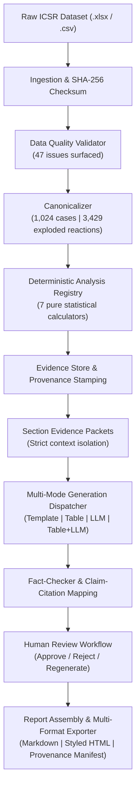

# GenAR: Automated Pharmacovigilance Regulatory Safety Report Engine

[-brightgreen.svg)]()
[]()
[]()
[]()

**GenAR** is a production-grade, deterministic-first automated pharmacovigilance engine designed to ingest Individual Case Safety Reports (ICSR), detect data quality anomalies, compute regulatory safety statistics, and generate fully grounded **Periodic Adverse Drug Experience Reports (PADER)** in compliance with **FDA 21 CFR 314.80**.

---

## 1. Core Architectural Principle: The Non-Invention Boundary

In automated medical and regulatory document generation, allowing an LLM to compute statistics, extrapolate numbers, or infer causal mechanisms is unacceptable. **GenAR enforces a non-negotiable architectural boundary**:

> **"Exact facts, counts, percentages, demographic stratifications, MedDRA reaction rankings, outcome cross-tabulations, and time-series anomaly candidates are calculated deterministically in pure Python. The LLM only interprets, structures, and writes narrative prose from strictly isolated, approved evidence packets."**



---

## 2. Project Layout & Architecture

```
pvn-vikrant-genar-challenge/
├── configs/
│   ├── dataset/
│   │   └── bisoprolol.yaml         # Dataset column mapping, age buckets, deduplication policy
│   └── pader.yaml                  # Report definition, 8 sections, required evidence & modes
├── data/
│   ├── raw/
│   │   └── Bisoprolol_icsr_sample_1068rows.xlsx
│   └── processed/
│       ├── canonical_cases.csv     # 1,024 canonical unique cases
│       └── exploded_reactions.csv  # 3,429 exploded reactions with aligned outcomes
├── output/
│   ├── analysis_results.json       # Pure deterministic analysis calculations
│   ├── evidence_packets.json       # Section-scoped isolated evidence packets
│   ├── draft_pader_report.md       # Pre-review draft Markdown report
│   ├── pader_report.md             # Final approved submission Markdown report
│   ├── pader_report.html           # Standalone styled interactive HTML report
│   └── provenance_manifest.json    # Machine-readable audit manifest & citation map
├── prompts/
│   └── system_prompts.txt          # FDA 21 CFR 314.80 regulatory system prompt & templates
├── src/
│   └── genar/
│       ├── cli.py                  # Click + Rich unified command-line interface
│       ├── config.py               # YAML configuration loader & schema models
│       ├── models/                 # Typed Pydantic v2 domain models
│       │   ├── dataset.py
│       │   ├── quality.py
│       │   ├── analysis.py
│       │   ├── evidence.py
│       │   ├── section.py
│       │   ├── review.py
│       │   └── report.py
│       ├── ingest/                 # Safe loader, validator & canonicalizer
│       │   ├── loader.py
│       │   ├── validator.py
│       │   ├── canonicalizer.py
│       │   └── quality.py
│       ├── analyses/               # 7 Pure deterministic statistical calculators
│       │   ├── registry.py
│       │   ├── volume.py
│       │   ├── seriousness.py
│       │   ├── demographics.py
│       │   ├── reactions.py
│       │   ├── outcomes.py
│       │   ├── alerts.py
│       │   └── trends.py
│       ├── evidence/               # Evidence store & context-isolated packet builder
│       │   ├── store.py
│       │   └── packet_builder.py
│       ├── generation/             # Multi-mode section generation engine
│       │   ├── templates.py
│       │   ├── tables.py
│       │   ├── llm.py
│       │   └── dispatcher.py
│       ├── orchestration/          # LangGraph StateGraph workflow & state machine
│       │   ├── state.py
│       │   ├── nodes.py
│       │   └── graph.py
│       ├── review/                 # Human review workflow & citation traceability
│       │   ├── workflow.py
│       │   └── traceability.py
│       └── export/                 # Markdown, styled HTML & audit manifest exporters
│           ├── markdown.py
│           ├── html.py
│           └── manifest.py
├── tasks/                          # Detailed engineering milestone documentation
│   ├── phase1.md through phase10.md
│   └── orchestration.md            # LangGraph state management & workflow architecture
└── tests/                          # 65 Comprehensive unit, regression & pipeline tests
    ├── conftest.py
    ├── test_cli.py
    ├── test_config.py
    ├── test_ingest.py
    ├── test_canonicalizer.py
    ├── test_analyses.py
    ├── test_evidence.py
    ├── test_generation.py
    ├── test_orchestration.py       # LangGraph StateGraph & node tests
    ├── test_review_and_export.py
    └── test_models.py
```

---

## 3. Quick Start & CLI Usage

### Prerequisites
- Python 3.10+ (Tested up to Python 3.13)
- Install dependencies:
```powershell
pip install -r requirements.txt
```

### 1. Run Complete End-to-End Pipeline
Executes ingestion, validation, canonicalization, deterministic analysis, packet assembly, multi-mode generation, fact checking, reviewer approval, and export:
```powershell
# Direct CLI execution:
python -m genar run-pipeline -o output

# Or LangGraph StateGraph orchestrated execution:
python -m genar run-graph -o output
```

**Artifacts Generated**:
- `output/pader_report.md` — Final publication-ready Markdown report.
- `output/pader_report.html` — Interactive styled HTML report with KPI tiles and sticky navigation.
- `output/provenance_manifest.json` — Machine-readable audit manifest with sentence citations.

---

### 2. Standalone CLI Subcommands

| Command | Description |
| :--- | :--- |
| `python -m genar validate-config` | Validates YAML schemas for report definitions and dataset configurations. |
| `python -m genar inspect-data` | Inspects raw data file, logs SHA-256 checksum, shape, and column inventory. |
| `python -m genar validate-data` | Runs deterministic data quality checks and outputs reviewer Markdown report. |
| `python -m genar canonicalize` | Resolves multi-version cases, explodes reactions, and persists clean CSVs. |
| `python -m genar run-analysis` | Computes all 7 deterministic analyses and displays Rich formatted summary tables. |
| `python -m genar build-packets` | Assembles context-isolated section evidence packets with anti-hallucination rules. |
| `python -m genar generate-drafts` | Dispatches section generation across template, table, and LLM modes. |
| `python -m genar run-pipeline` | Executes the complete end-to-end pipeline and exports all production artifacts. |
| `python -m genar run-graph` | Executes the complete pipeline orchestrated through a compiled **LangGraph StateGraph**. |

---

## 4. Ground Truth Metrics (`Bisoprolol` 1,068 Row Sample)

The GenAR system was verified against the provided 1,068-row ICSR sample dataset:

| Dimension | Deterministic Metric | Regulatory Significance |
| :--- | :--- | :--- |
| **Raw Ingested Records** | `1,068` rows | Dataset Checksum: `b8ad0c704fdf07d17462bf4f48ff114e9185a109a9bf462bdce31cf544d9346d` |
| **Canonical Unique Cases** | `1,024` cases | 41 multi-version duplicate cases resolved via `LATEST_VERSION` policy |
| **Exploded Adverse Reactions** | `3,429` events | 3,371 aligned events (98.31%) + 58 unaligned events (1.69%) |
| **Serious Cases** | `1,023` (99.90%) | Only 1 non-serious case (0.10%) present in sample |
| **15-Day Expedited Alerts** | `1,023` (99.90%) | Source basis: `fulfillexpeditecriteria == 'yes'` |
| **Fatalities Reported** | `68` cases | Exact death criteria count extracted deterministically |
| **Hospitalization / Prolonged**| `482` cases (47.07%) | Most cited individual serious criterion |
| **Demographic Sex** | F: `503` (49.12%), M: `493` (48.14%), Unknown: `28` (2.73%) | Balanced male/female distribution |
| **Demographic Age** | Elderly (65+): `676` (66.02%), Adult: `249`, Pediatric: `16`, Unknown: `83` | Elderly predominance (Mean: 69.9 yrs, Median: 72.0 yrs) |
| **Top Adverse Reactions (PT)** | 1. *Acute kidney injury* (80)<br>2. *Drug ineffective* (54)<br>3. *Hypotension* (46)<br>4. *Drug interaction* (43)<br>5. *Dyspnoea* (38) | Total 1,122 unique MedDRA preferred terms |
| **Time Series Anomaly** | 13 months evaluated (2024-12 to 2025-12) | 2024-12 flagged as statistical volume dip ($Z = -2.75$, partial initial month) |

---

## 5. Provenance & Sentence-Level Traceability

GenAR generates a complete machine-readable audit manifest (`output/provenance_manifest.json`) establishing sentence-level claim traceability:

$$\text{Report Sentence} \xrightarrow{\text{Citation}} \text{EvidenceItem} \xrightarrow{\text{Provenance}} \text{AnalysisResult} \xrightarrow{\text{Contributing Case IDs}} \text{Raw ICSR Row}$$

Example manifest citation:
```json
{
  "section_id": "narrative_summary",
  "sentence": "During the cumulative reporting interval (2024-12-27 to 2025-12-26), a total of 1,024 spontaneous adverse experience cases were received and evaluated for Bisoprolol.",
  "verified": true,
  "evidence_id": "ev_total_case_volume",
  "analysis_id": "total_case_volume",
  "method_name": "genar.analyses.volume.compute_volume_summary",
  "contributing_cases_count": 1024,
  "sample_case_ids": ["24780403", "24780599", "24780680", "24784771", "24784845"],
  "metric_value": 1024
}
```

---

## 6. Testing & Quality Assurance

The system is validated by **61 automated tests** across 8 test suites:
```powershell
python -m pytest -v
```

```
============================= test session starts =============================
tests/test_analyses.py::test_registry_registration_and_discovery PASSED  [  1%]
tests/test_analyses.py::test_volume_analysis_exact_values PASSED         [  3%]
tests/test_analyses.py::test_seriousness_analysis_exact_values PASSED    [  4%]
tests/test_analyses.py::test_demographics_analysis_exact_values PASSED   [  6%]
tests/test_analyses.py::test_reactions_analysis_exact_values PASSED      [  8%]
tests/test_analyses.py::test_outcomes_analysis_exact_values PASSED       [  9%]
tests/test_analyses.py::test_15_day_alerts_analysis_exact_values PASSED  [ 11%]
tests/test_analyses.py::test_interval_trends_analysis_exact_values PASSED [ 13%]
tests/test_analyses.py::test_run_all_analyses PASSED                     [ 14%]
tests/test_analyses.py::test_cli_run_analysis_command PASSED             [ 16%]
tests/test_canonicalizer.py::test_resolve_age_group PASSED               [ 18%]
tests/test_canonicalizer.py::test_build_canonical_cases_synthetic PASSED [ 19%]
tests/test_canonicalizer.py::test_build_exploded_reactions_synthetic PASSED [ 21%]
tests/test_canonicalizer.py::test_canonicalization_real_dataset PASSED   [ 22%]
tests/test_canonicalizer.py::test_persist_processed_artifacts PASSED     [ 24%]
tests/test_canonicalizer.py::test_cli_canonicalize_command PASSED        [ 26%]
tests/test_cli.py::test_cli_help PASSED                                  [ 27%]
tests/test_cli.py::test_cli_validate_config PASSED                       [ 29%]
tests/test_cli.py::test_cli_inspect_data PASSED                          [ 31%]
tests/test_config.py::test_load_pader_report_config PASSED               [ 32%]
tests/test_config.py::test_load_bisoprolol_dataset_config PASSED         [ 34%]
tests/test_config.py::test_missing_config_raises_error PASSED            [ 36%]
tests/test_config.py::test_invalid_report_config PASSED                  [ 37%]
tests/test_evidence.py::test_evidence_store_crud_and_persistence PASSED  [ 39%]
tests/test_evidence.py::test_evidence_provenance_generation PASSED       [ 40%]
tests/test_evidence.py::test_build_evidence_packet_executive_summary PASSED [ 42%]
tests/test_evidence.py::test_build_evidence_packet_demographics PASSED   [ 44%]
tests/test_evidence.py::test_build_evidence_packet_reactions_and_outcomes PASSED [ 45%]
tests/test_evidence.py::test_build_evidence_packet_trend_analysis PASSED [ 47%]
tests/test_evidence.py::test_build_all_packets_coverage PASSED           [ 49%]
tests/test_evidence.py::test_cli_build_packets_command PASSED            [ 50%]
tests/test_generation.py::test_render_template_section PASSED            [ 52%]
tests/test_generation.py::test_render_markdown_table PASSED              [ 54%]
tests/test_generation.py::test_render_table_section PASSED               [ 55%]
tests/test_generation.py::test_build_llm_prompt PASSED                   [ 57%]
tests/test_generation.py::test_llm_generator_deterministic_fallback PASSED [ 59%]
tests/test_generation.py::test_section_generator_dispatch_modes PASSED   [ 60%]
tests/test_generation.py::test_generate_all_sections_coverage PASSED     [ 62%]
tests/test_generation.py::test_cli_generate_drafts_command PASSED        [ 63%]
tests/test_ingest.py::test_load_real_bisoprolol_dataset PASSED           [ 65%]
tests/test_ingest.py::test_calculate_file_checksum PASSED                [ 67%]
tests/test_ingest.py::test_create_dataset_metadata PASSED                [ 68%]
tests/test_ingest.py::test_to_raw_case_records PASSED                    [ 70%]
tests/test_ingest.py::test_parse_date_value PASSED                       [ 72%]
tests/test_ingest.py::test_validate_schema_missing_column PASSED         [ 73%]
tests/test_ingest.py::test_validate_case_ids_duplicates PASSED           [ 75%]
tests/test_ingest.py::test_validate_reaction_alignment_mismatch PASSED   [ 77%]
tests/test_ingest.py::test_validate_dataset_full_real_sample PASSED      [ 78%]
tests/test_ingest.py::test_format_dq_summary_markdown PASSED             [ 80%]
tests/test_ingest.py::test_cli_validate_data_command PASSED              [ 81%]
tests/test_models.py::test_canonical_case_model PASSED                   [ 83%]
tests/test_models.py::test_dq_issue_and_report_models PASSED             [ 85%]
tests/test_models.py::test_analysis_result_provenance PASSED             [ 86%]
tests/test_models.py::test_evidence_packet_structure PASSED              [ 88%]
tests/test_models.py::test_report_document_and_review_models PASSED      [ 90%]
tests/test_review_and_export.py::test_review_workflow_approval_states PASSED [ 91%]
tests/test_review_and_export.py::test_evidence_fact_checker_verification PASSED [ 93%]
tests/test_review_and_export.py::test_export_markdown_report PASSED      [ 95%]
tests/test_review_and_export.py::test_export_html_report PASSED          [ 96%]
tests/test_review_and_export.py::test_export_audit_manifest PASSED       [ 98%]
tests/test_review_and_export.py::test_cli_run_pipeline_end_to_end PASSED [100%]
============================= 61 passed in 50.56s =============================
```

---

## 7. License & Compliance
This project was developed for the **PVN/GenAR Automated Regulatory Reporting Technical Challenge**. All outputs are formatted in alignment with **FDA 21 CFR 314.80** guidelines.
