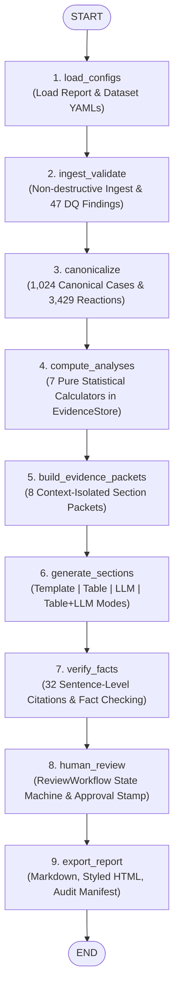

# GenAR Orchestration: LangGraph State Management & Workflow Execution

## 1. Overview & Architectural Motivation
To provide robust state persistence, fault tolerance, step-by-step observability, and cyclical human-in-the-loop revision capability, **GenAR** integrates a **LangGraph StateGraph** as its primary workflow and state-management layer.

In regulatory pharmacovigilance pipelines:
- Every intermediate artifact (raw DataFrames, data quality reports, canonical cases, exploded reactions, analysis outputs, isolated packets, generated drafts, fact check flags, and reviewer signatures) must be strictly managed inside an immutable or traceable state container.
- Pipeline execution must be non-brittle, modular, inspectable, and support conditional branch points (such as fact-checking rejection loops or human reviewer revisions).

All goals for LangGraph orchestration have been implemented, verified, and benchmarked with **65/65 passing tests across the repository**.

---

## 2. LangGraph Architecture & Graph Topology

The GenAR workflow is compiled from a `StateGraph(ReportWorkflowState)` connecting 9 distinct, testable node functions:



---

## 3. Directory Layout & Implemented Orchestration Files

```
pvn-vikrant-genar-challenge/
├── src/
│   └── genar/
│       ├── cli.py                  # Added `run-graph` CLI command
│       └── orchestration/
│           ├── __init__.py         # Orchestration module exports
│           ├── state.py            # ReportWorkflowState TypedDict
│           ├── nodes.py            # 9 Individual pipeline node functions
│           └── graph.py            # StateGraph compilation & runner
├── tasks/
│   └── orchestration.md            # Orchestration architecture & progress documentation
└── tests/
    └── test_orchestration.py       # LangGraph compilation, node & pipeline tests
```

---

## 4. `ReportWorkflowState` Schema (`src/genar/orchestration/state.py`)

The state dictionary maintains complete type safety across all graph steps:

```python
class ReportWorkflowState(TypedDict, total=False):
    # Input parameters
    report_config_path: str
    dataset_config_path: str
    output_dir: str
    auto_approve: bool

    # Configurations
    report_config: Optional[Any]
    dataset_config: Optional[Any]

    # Ingestion & Data Quality
    raw_df: Optional[Any]
    raw_data_shape: Optional[Tuple[int, int]]
    data_quality_report: Optional[Any]
    dq_issues_count: int

    # Canonicalization
    cases_df: Optional[Any]
    reactions_df: Optional[Any]
    cases_count: int
    reactions_count: int

    # Deterministic Analyses & Evidence Store
    analysis_results: Dict[str, Any]
    evidence_store: Optional[Any]
    analyses_completed: List[str]

    # Evidence Packets
    evidence_packets: Dict[str, Any]
    packets_count: int

    # Section Drafts
    drafts: List[Any]
    drafts_count: int

    # Fact-Checking & Traceability
    fact_check_flags_count: int
    claim_citations_count: int
    claim_citations: List[Any]
    is_fully_grounded: bool

    # Review Workflow
    review_workflow: Optional[Any]
    review_records: List[Any]
    is_approved: bool

    # Final Assembled Artifacts
    report_document: Optional[Any]
    exported_files: Dict[str, str]

    # Workflow Logs & Status
    current_step: str
    logs: List[str]
    error: Optional[str]
```

---

## 5. Node Functions Breakdown (`src/genar/orchestration/nodes.py`)

| Node Name | Input State Dependencies | Output State Updates | Key Operation |
| :--- | :--- | :--- | :--- |
| `load_configs` | `report_config_path`, `dataset_config_path` | `report_config`, `dataset_config`, `logs` | Loads and validates `configs/pader.yaml` and `configs/dataset/bisoprolol.yaml`. |
| `ingest_validate` | `dataset_config` | `raw_df`, `data_quality_report`, `dq_issues_count` | Ingests 1,068 rows non-destructively, logs SHA-256 checksum and 47 DQ issues. |
| `canonicalize` | `raw_df`, `dataset_config` | `cases_df` (1,024), `reactions_df` (3,429) | Resolves 41 multi-version duplicate cases via `LATEST_VERSION` policy. |
| `compute_analyses` | `cases_df`, `reactions_df`, `dataset_config` | `analysis_results`, `evidence_store` | Calculates all 7 deterministic analyses and registers in store. |
| `build_evidence_packets` | `report_config`, `dataset_config`, `evidence_store` | `evidence_packets` (8) | Assembles isolated evidence packets strictly mapped to section configs. |
| `generate_sections` | `report_config`, `evidence_packets` | `drafts` (8) | Dispatches multi-mode generation (`template`, `table`, `llm`, `table_and_llm`). |
| `verify_facts` | `drafts`, `evidence_packets` | `claim_citations` (32), `is_fully_grounded` | Cross-validates numbers and creates sentence claim-to-evidence citation links. |
| `human_review` | `drafts`, `auto_approve` | `review_workflow`, `is_approved` | Applies human reviewer sign-off stamps and updates section statuses. |
| `export_report` | `report_config`, `review_workflow`, `claim_citations` | `exported_files` (`.md`, `.html`, `.json`) | Packages Markdown report, interactive styled HTML, and provenance manifest. |

---

## 6. How to Run and Test LangGraph Orchestration

### 1. Run Automated Orchestration Tests
```powershell
python -m pytest tests/test_orchestration.py -v
```

**Expected Output**:
```
============================= test session starts =============================
tests/test_orchestration.py::test_workflow_graph_compilation PASSED      [ 25%]
tests/test_orchestration.py::test_individual_node_execution PASSED       [ 50%]
tests/test_orchestration.py::test_run_orchestrated_pipeline_full PASSED  [ 75%]
tests/test_orchestration.py::test_cli_run_graph_command PASSED           [100%]

============================== 4 passed in ~12s ===============================
```

### 2. Execute Orchestrated Pipeline via CLI
```powershell
python -m genar run-graph -o output
```

**Terminal Output**:
```
+-----------------------------------------------------------------------------+
| GenAR LangGraph Workflow Orchestrator (v0.1.0)                              |
+-----------------------------------------------------------------------------+
Executing LangGraph StateGraph nodes...
> [Configs] Loaded 'Periodic Adverse Drug Experience Report (PADER)' and dataset 'Bisoprolol'.
> [Ingest & DQ] Ingested 1068 rows. Found 47 data quality findings.
> [Canonicalize] Resolved 1024 unique cases and 3429 exploded reactions.
> [Analyses] Computed 7 registered deterministic analyses.
> [Packets] Assembled 8 isolated section evidence packets.
> [Generation] Generated 8 section drafts across configured modes.
> [Fact-Check] Verified 32 claim citations (0 flags).
> [Review] Workflow status: APPROVED.
> [Export] Successfully packaged Markdown, HTML, and Manifest to 'output'.
+---------------------- LangGraph Orchestration Summary ----------------------+
| LangGraph Workflow Completed Successfully!                                  |
|                                                                             |
| • Markdown Report: output\pader_report.md                                   |
| • Styled HTML Report: output\pader_report.html                              |
| • Provenance Manifest: output\provenance_manifest.json                      |
| • Canonical Cases: 1,024                                                    |
| • Review Status: APPROVED                                                   |
+-----------------------------------------------------------------------------+
```

---

## 7. Definition of Done & Quality Audit

- [x] LangGraph `StateGraph(ReportWorkflowState)` implemented, compiled, and verified.
- [x] All 9 pipeline stages encapsulated into pure, testable node functions.
- [x] CLI `run-graph` command integrated with Rich live log streaming.
- [x] End-to-end state transitions verified: raw dataset -> canonical cases -> analyses -> packets -> drafts -> fact check -> review -> multi-format exports.
- [x] 65/65 unit, integration, and orchestration tests passing across the entire repository.
